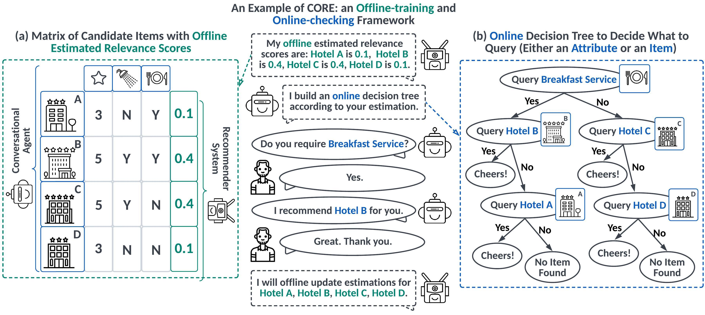

# Conversational Agent for Recommender System (CORE)


<p align="center">
    <a href="https://jinjiarui.github.io/core/">Project</a> |
    <a href="https://jinjiarui.github.io/preprints/CORE.pdf">Paper</a> |
    <a href="https://core-labet.readthedocs.io/en/latest/">Documentation</a>
</p>

**CORE** is a plug-and-play conversational agent for any recommender system built upon [PyTorch](https://pytorch.org). 
CORE is:

- **Comprehensive**: CORE provides a data manager, an offline trainer, and an online checker.
- **Flexible**: CORE could be integrated into any recommender system.
- **Efficient**: CORE is built upon an online decision tree algorithm instead of heavily learning algorithms.

--------------------------------------------------------------------------------


## Brief Introduction
CORE is a new offline-training and online checking paradigm that bridges conversational agent and recommender systems via a unified uncertainty minimization framework.
It could benefit any recommendation platform in a plug-and-play style.
Here, CORE treats a recommender system as an offline relevance score estimator to produce an estimated relevance score for each item; while a conversational agent is regarded as
an online relevance score checker to check these estimated scores in each session.
We define uncertainty as the summation of unchecked relevance scores. 
In this regard, the conversational agent acts to minimize uncertainty by querying either attributes or items. Based on the uncertainty minimization framework, we derive the expected certainty gain of querying each attribute and item and develop a novel online decision tree algorithm to decide what to query at each turn. 




## Use Cases
The significant advantage of CORE is that CORE can be easily deployed on any existing recommendation platform because CORE acts as a bridge connecting the conversational agent and recommender agent.
In other words, in the proposed offline-training and online-checking paradigm, CORE only requires the estimated relevance scores from the recommender agent and the render (including both text extractor and text generator) from the conversational agent.


## ToDo (Latest Update at 2023/07/24)
- [x] Release top-1 Recommendation where action space includes candidate items (e.g., whether she likes a dress), candidate attributes (e.g., what color she likes),
      and candidate attribute values (e.g., whether she likes a red dress).
- [x] Release top-N recommendation where action space includes 
- [ ] Release large language models based render to allow the conversational agent to communicate like humans.
- [ ] Release pre-processed datasets and more datasets with textual features.
- [ ] Release detailed document tutorial and readme guidance.


## Citing CORE
```bibtex
@software{CORE,
  author = {Jiarui Jin, Xianyu Chen, Fanghua Ye, Mengyue Yang, Yue Feng, Weinan Zhang, Yong Yu, and Jun Wang},
  title = {Core: A Plug-and-Play Conversational Agent for Recommender System},
  year = {2023},
  publisher = {GitHub},
  journal = {GitHub repository},
  version = {0.0},
  howpublished = {\url{https://github.com/CORE-Labet/CORE}},
}
```


## The Team
Core developers of the CORE system are [Jiarui Jin](https://github.com/Jinjiarui) and [Xianyu Chen](https://github.com/ChenXianyu2002).


## License
CORE is released under the Apache License, Version 2.0.
